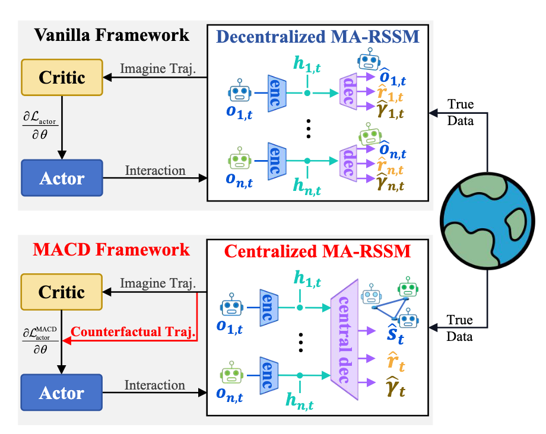

# Dreamer 多智能体扩展横向对比

前置：[[rl-lit-review/notes/Dreamer|Dreamer 原理解析]]（RSSM、V2/V3 损失、λ-return、想象反传）。本文不重抄公式，只比 **多智能体扩展在 MBRL 各环节上改了什么**。

相对单智能体 Dreamer，这族工作主要动两处：（1）**信息怎么进入世界模型**（通信 / 集中–分散拓扑）；（2）**想象轨迹怎么变成策略梯度**（是否反事实、是否阻断 WM、是否掺规划）。下文按环节写差分，文末一张标签总表。

## 对比对象与主轴

固定顺序（全文一致）：

| 简称 | 论文 | Zotero | 主问题（一句话） |
|------|------|--------|------------------|
| **MAMBA** | *Scalable Multi-Agent Model-Based Reinforcement Learning*（AAMAS 2022） | `FC3KDTF4` | 首个 DreamerV2→MARL；通信进**独立** WM；常用基线 |
| **MACD** | *Aligning Credit… Counterfactual Imagination*（AAMAS 2024） | `GMJKJCFY` | 集中式 WM + CIDE；反事实想象做信用分配 |
| **CoDreamer** | *CoDreamer: Communication-Based Decentralised World Models*（CoCoMARL 2024） | `5L4EHNIV` | 分布式 RSSM + **双层 GNN**（模型侧 / 策略侧） |
| **MARIE** | *Decentralized Transformers with Centralized Aggregation…*（2025） | `9BE6RA66` | VQ 分词 + Perceiver 聚合 + 因果 Transformer 动力学 |
| **LBI** | *Grounded Answers… through Generative World Model*（NeurIPS 2024） | `UBKRHQT4` | VisionSMAC；生成式动力学 + 语言引导 IRL 奖励 |
| **CLWPO** | *Acting Beyond Learning…*（AAAI 2025） | `IJX9HRK3` | 对比潜动力学；无模型学习 + 想象规划混合 |
| **M3W** | *Learning and Planning… MoE-based World Model*（NeurIPS 2025） | `2D2GIHGC` | decoder-free；MoE 动力学/奖励；学习 + MPPI 规划 |

> 简称 **MARIE / LBI** 沿用组会与本地笔记习惯；正式题名以上表为准。

---

## 1. 表征（$o \to$ 潜状态）

单智能体 Dreamer：编码器把观测压进 $z_t$（V1 连续高斯；V2/V3 离散 categorical）。

- **MAMBA / MACD / CoDreamer**：RSSM。
- **MARIE / LBI**：观测 → **VQ-VAE 分词** → token 序列 → 因果 Transformer
- **CLWPO**： CNN->GRU->MLP 与RSSM不同之处在于转移模型直接使用全局状态s和动作a，相当于没有rssm的后验。
- **M3W**：标准潜动力学，无decoder，RSSM等时序建模

---

## 2. 通信

- **MAMBA / MACD**：Transformer **通信块**，把各智能体的 $z,a$ 编成通信特征 $e$，再喂入世界模型
- **CoDreamer**：**GNN** 双层通信——节点 = 智能体，边 = 欧氏距离 < 通信范围 $C$，边特征为相对距离。一层在**世界模型内部**（见 §3），一层在 **Actor–Critic**（见 §6）。
- **MARIE**：$(x^1_{t,1},\ldots,x^1_{t,K},a^1_t,\ldots,x^n_{t,1},\ldots,x^n_{t,K},a^n_t)$ → Perceiver 聚合 → $(e^1_t,e^2_t,\ldots,e^n_t)$
- **CLWPO**： VAE 聚合隐状态si，再做奖励/转移
- **LBI / M3W**：无显式通信模块，直接聚合

---

## 3. 世界模型拓扑

RSSM 数据流见 Dreamer 笔记；多智能体要选 **独立 / 集中 / 分布+聚合**。

- **MAMBA（上图 Vanilla）**：每智能体独立编解码与预测头 $\hat o_i,\hat r_i,\hat\gamma_i$。
- **MACD（下图）**：编码仍可按智能体，但 **central decoder**：聚合各 $h_i$ 后预测全局 $\hat s_t,\hat r_t,\hat\gamma_t$。
- **CoDreamer**：DreamerV3 backbone 得各 $h_t,z_t$ → 构图 $G_t$ → **GNN** 出奖励/终止头；**观测重建不走 GNN**（仍独立）。
- **MARIE / LBI**：分布式**因果 Transformer**。
- **CLWPO**：**世界模型集中**（全局隐状态上做转移/奖励）。
- **M3W**：观测分散，奖励由稀疏专家集中。

---

## 4. 预测头与损失

对齐 Dreamer：**预测（重建/$r$/$\gamma$）+ KL（V2 单向；V3 双向 + free bits）**。

- **MAMBA**：≈ **DreamerV2**——预测损失（重建观测 + 奖励 + 折扣）+ 先验–后验 KL；**无** V3 双向 KL。
- **MACD / CoDreamer**：世界模型 / 集中式 critic 目标 ≈ **DreamerV3**。
- **MARIE**：预测损失（重建观测 token + 奖励 + 折扣）。
- **LBI**：动力学极大似然式下一帧；奖励头用 **IRL 风格**——专家轨迹高奖励、自探索轨迹低奖励（双向 Transformer 吃完整轨迹）。
- **CLWPO**：用 **对比变分界（CVB）** 优化潜世界模型。
- **M3W**：损失 = 动力学（转移对齐编码）+ 奖励 + Q。

---

## 5. Actor–Critic

单智能体 Dreamer：想象价值可经可微转移 **pathwise 回传** actor。MARL 扩展常改掉这一点。critic： λ-target（平衡偏差

- **MAMBA**：**MAPPO**；**梯度不穿世界模型**
- **MACD**：MAPPO+策略用 **反事实优势**（真轨迹与 agent 零动作轨迹的差）缓解信用分配。
- **CoDreamer**：WM 输出的 $h,z$ 构图送入策略/评价；A/C 侧再跑一层 GNN；目标形态接近 V3 想象回报。
- **MARIE**：critic = MLP + 自注意力吃全局信息；actor = MLP + **MAPPO**。
- **CLWPO**：损失 = **MASAC（无模型）** + 加权隐空间（模型）项；规划段用队友模型与自适应 horizon。
- **M3W**：HASAC 训 actor；**规划期 MPPI**，不单纯依赖显式策略网络出最终动作。
- **LBI**：？

---

## 总表（标签索引）

每格只做定位；细节回上文对应节。

| 环节 | MAMBA | MACD | CoDreamer | MARIE | LBI | CLWPO | M3W |
|------|-------|------|-----------|-------|-----|-------|-----|
| 表征 | RSSM | 同左 | RSSM | VQ token→因果 TF | 同左 | CNN→GRU→MLP | 无 decoder+RSSM |
| 通信 | TF→$e$ | 同 MAMBA | GNN 双层 | Perceiver 聚合 | — | VAE 聚合 $s_i$ | — |
| WM 拓扑 | 独立头 | 集中 decoder | 分布+GNN 奖/终止 | 分布因果 TF | 同左 | 集中潜模型 | 观测分散+MoE 奖 |
| 损失 | ≈V2 | ≈V3 | ≈V3 | 预测 token+$r$+$\gamma$ | 动态+IRL | CVB | 转移+奖+Q |
| A/C | MAPPO，断 WM 梯度 | MAPPO+反事实优势 | GNN A/C | MAPPO+Attn critic | ？ | MASAC+潜规划 | HASAC+MPPI |

架构图：`assets/MAMBA_Architecture.png`、`assets/MARIN_arch.png`、`assets/comparison_MBMBA_MACD.png`。

---
